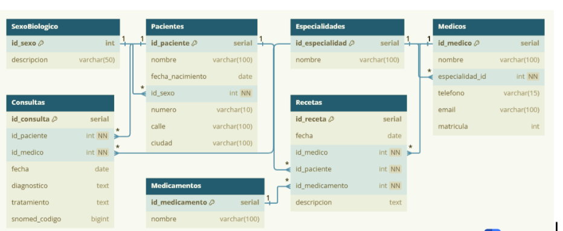
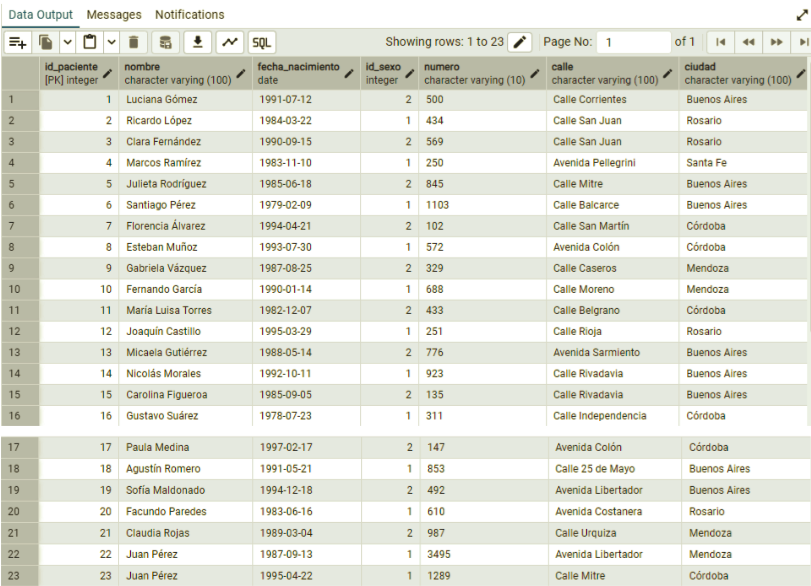

# Trabajo Práctico 5 - Informática Médica

**Alumnos**: Tralma, Solari  
**Fecha**: 24 de mayo de 2025   

Este documento contiene la resolución completa del TP4, incluyendo las 
consignas de la Parte 1 y Parte 2, con las consultas SQL y los resultados 
obtenidos.

---

## Parte 1

### 1. ¿Qué tipo de base de datos es? Clasificarla según estructura y función.

La base de datos a utilizar se puede clasificar como **relacional** según 
estructura (SQL) y **transaccional** según su función.

En primer lugar, una base de datos relacional es aquella que organiza los 
datos en tablas relacionadas mediante claves primarias y foráneas, y usa 
el lenguaje SQL para gestionar y manipular la información a través de 
transacciones (he aquí su función como BD transaccional). Tiene una 
estructura lógica en tablas, provee integridad de los datos mediante 
restricciones, y permite que se realicen consultas eficientes. Además, 
sigue las propiedades ACID (Atomicidad, Consistencia, Aislamiento y 
Durabilidad), garantizando que las transacciones sean seguras, coherentes 
y recuperables. Esto la hace ideal para manejar grandes volúmenes de datos 
con relaciones complejas, asegurando su integridad y accesibilidad. Por 
otro lado, al ser transaccional permite algunas funciones principales como 
lectura simple, modificaciones de datos, acciones individuales o en bulk.

Primero resolveremos los puntos 2, 3 y 4 considerando otra forma de resolver el diseño de la base de datos usando únicamente la información brindada en el texto. Luego resolveremos los mismos puntos utilizando la implementación hecha por la cátedra.
---

### 2. Armar el diagrama entidad-relación de la base de datos dada.

El modelo entidad-relación (DER) es un método gráfico que muestra las 
características más importantes de la base de datos. Sirve como un esquema 
visual que muestra cómo interactúan las entidades (objetos o conceptos del 
mundo real) dentro de un dominio específico. Es una herramienta que 
permite a los diseñadores de bases de datos visualizar la estructura de la 
información antes de implementar la base de datos. En él se muestran 
entidades, atributos y sus tipos, PK (primary keys), FK (foreign keys), 
relaciones, cardinalidades.

#### Modelo Propuesto

Para armar el diagrama identificamos las siguientes entidades con sus 
atributos:

- **Paciente**:
  - id_paciente (PK)
  - Nombre
  - Fecha de nacimiento
  - Sexo biológico
  - Dirección (atributo compuesto):
    - Calle
    - Número
    - Ciudad
- **Especialidad**:
  - id_especialidad (PK)
  - Nombre
- **Médico**:
  - id_medico (PK)
  - Nombre_m
  - id_especialidad (FK)
  - Dirección profesional (atributo compuesto):
    - Calle_m
    - Número_m
    - Ciudad_m
- **Consulta**:
  - id_consulta (PK)
  - Fecha_c
  - id_medico (FK)
  - id_paciente (FK)
  - Diagnóstico
  - id_enfermedad (FK)
- **Receta**:
  - id_receta (PK)
  - id_medico (FK)
  - id_paciente (FK)
  - Fecha
  - id_enfermedad (FK)
  - Medicamento
  - Tratamiento
  - Duración
- **Enfermedad**:
  - id_enfermedad (PK)
  - Nombre_e

**Nota**: En el caso de las recetas, no vinculamos las mismas a una 
consulta, ya que un médico podría emitir una receta en un contexto no 
registrado como consulta (como por ejemplo una renovación de medicación).

**Diagrama Entidad-Relación (Propuesto)**:


#### Modelo de la Cátedra

Entidades con sus atributos:

- **Pacientes**:
  - id_paciente (PK)
  - Nombre
  - Fecha de nacimiento
  - id_sexo (FK)
  - Dirección (atributo compuesto):
    - Calle
    - Número
    - Ciudad
- **Sexo biológico**:
  - id_sexo (PK)
  - Descripción
- **Especialidades**:
  - id_especialidad (PK)
  - Nombre
- **Médicos**:
  - id_medico (PK)
  - Nombre
  - Teléfono
  - Email
  - Matrícula
  - id_especialidad (FK)
- **Consultas**:
  - id_consulta (PK)
  - id_paciente (FK)
  - id_medico (FK)
  - Fecha
  - Diagnóstico
  - Tratamiento
  - snomed_codigo
- **Medicamentos**:
  - id_medicamento (PK)
  - Nombre
- **Recetas**:
  - id_receta (PK)
  - Fecha
  - id_medico (FK)
  - id_paciente (FK)
  - id_medicamento (FK)
  - Descripción

**Diagrama Entidad-Relación (Cátedra)**:


---

### 3. Armar el modelo lógico entidad-relación de la base de datos dada.

#### Modelo Propuesto

El modelo lógico entidad-relación fue realizado con dbdiagram.io, teniendo 
en cuenta el DER realizado anteriormente.

**Nota**: Una receta podría no tener una enfermedad asociada, por eso se 
establece como una relación opcional, a diferencia de las demás, que son 
relaciones obligatorias.

**Modelo Lógico (Propuesto)**:


#### Modelo de la Cátedra

El modelo lógico entidad-relación fue realizado con dbdiagram.io, teniendo 
en cuenta el DER de la cátedra.

**Modelo Lógico (Cátedra)**:
 

---

### 4. ¿Considera que la base de datos está normalizada? En caso que no lo esté, ¿cómo podría hacerlo?

#### Modelo Propuesto

La normalización sirve para que las tablas estén estructuradas 
correctamente. Para lograr esto, se siguen tres normas formales. La 
primera norma formal indica que cada celda de la tabla puede tener un solo 
valor. No se admiten json ni arreglos ni ninguna otra estructura que no 
sea primitiva. Todas las filas deben tener el mismo número de columnas y 
además debe haber una clave primaria para cada fila. La segunda norma 
formal hace referencia a que todos los atributos deben ser totalmente 
dependientes de su clave primaria, no debe haber dependencias parciales. 
Por último, la tercera norma formal indica que cada columna que no sea 
clave debe ser independiente de las demás columnas. Para que una tabla se 
considere normalizada, se deben cumplir las tres normas.

Teniendo esto en cuenta, notamos que la base de datos analizada no está 
completamente normalizada. A pesar de que hay tablas correctamente 
normalizadas, como por ejemplo la de especialidad, hay otras que presentan 
algunos problemas. Por ejemplo, se debería dividir el atributo “Nombre” en 
“Nombre” y “Apellido”, tanto en el caso de los pacientes como de los 
médicos. Además, se debería agregar una entidad que haga referencia al 
“Sexo Biológico”, en el que se delimiten el sexo mediante un id_sexo como 
PK, para luego ser usado como FK en la tabla de pacientes, esto evitará 
errores del tipo escribir “Mujer” en vez de “Femenino”. Además, tanto en 
la tabla paciente como en la de médico podría haber inconsistencias o 
errores de escritura en el campo de la ciudad, como por ejemplo “CABA”, 
“Ciudad Autónoma de Buenos Aires” y “Capital Federal”. Para corregir esto 
se debería crear una tabla específica para las ciudades, donde cada una 
tenga un “id_ciudad” que se use como FK en la tabla Paciente y Médico, 
eliminando la redundancia y cumpliendo la tercera norma formal.

#### Modelo de la Cátedra

En este caso, notamos que la base de datos analizada no está completamente 
normalizada. Si bien parece que se cumplen los requisitos en gran escala 
(o sea, las normas formales 1 y 2), se presentan algunas fallas en el 
cumplimiento de la norma formal 3. A diferencia del modelo propuesto 
anteriormente, ahora sí se genera una tabla normalizada para el “Sexo 
Biológico”, delimitando el sexo mediante id_sexo (PK) y luego usando dicha 
información en la tabla Pacientes como una FK. Esto es muy útil para 
evitar errores y redundancia de información, ya que garantiza que solo 
existan dos valores (“Masculino” y “Femenino”). Por otro lado, en la tabla 
paciente se ven inconsistencias o errores de escritura en el campo de la 
ciudad, como por ejemplo “Bs As”, “Buenos Aires” y “buenos aires”. Para 
corregir esto se debería crear una tabla específica para las ciudades, 
donde cada una tenga un “id_ciudad” que se use como FK en la tabla 
Paciente, eliminando la redundancia y cumpliendo la tercera norma formal.

En la tabla de Consultas, se podría normalizar el código de SNOMED para 
evitar discrepancias que podrían generarse por errores de tipeo y entonces 
todos podrían utilizar el mismo estándar. Para esto se puede hacer una 
nueva tabla donde se enlistan los diferentes diagnósticos y su PK 
identifique al código SNOMED.

---

## Parte 2

### 1. Cuando se realizan consultas sobre la tabla paciente agrupando por ciudad los tiempos de respuesta son demasiado largos.Proponer mediante una query SQL una solución a este problema.

**Consulta SQL:**

```sql
CREATE INDEX idx_ciudad_normalizada
ON pacientes (TRIM(LOWER(ciudad)));
SELECT indexname, indexdef
FROM pg_indexes
WHERE tablename = 'pacientes';
```


### 2.Se tiene la fecha de nacimiento de los pacientes. Se desea calcular la edad de los pacientes y almacenarla de forma dinámica en el sistema ya que es un valor típicamente consultado, junto con otra información relevante del paciente.

**Consulta SQL:**
```sql
CREATE OR REPLACE VIEW vista_pacientes_con_edad AS
SELECT
    id_paciente,
    nombre,
    fecha_nacimiento,
    ciudad,
    EXTRACT(YEAR FROM AGE(CURRENT_DATE, fecha_nacimiento)) AS edad
FROM pacientes;
SELECT * FROM vista_pacientes_con_edad;
```


### 3.La paciente, “Luciana Gómez”, ha cambiado de dirección. Antes vivía en “Avenida Las Heras 121” en “Buenos Aires”, pero ahora vive en “Calle Corrientes 500” en “Buenos Aires”. Actualizar la dirección de este paciente en la base de datos.

**Consulta SQL:**
```sql
#Ej 3
SELECT * FROM pacientes WHERE nombre = 'Luciana Gómez';
UPDATE pacientes
SET calle = 'Calle Corrientes',
    numero = '500',
    ciudad = 'Buenos Aires'
WHERE nombre = 'Luciana Gómez';
SELECT * FROM pacientes WHERE nombre = 'Luciana Gómez';

```


### 4.Seleccionar el nombre y la matrícula de cada médico cuya especialidad sea identificada por el id 4.

**Consulta SQL:**
```sql
#Ej 4
SELECT nombre, matricula
FROM medicos
WHERE especialidad_id = 4;
```


### 5.Puede pasar que haya inconsistencias en la forma en la que están escritos los nombres de las ciudades, ¿cómo se corrige esto?Agregar la query correspondiente.

**Consulta SQL:**
```sql
#Ej 5
-- Buenos Aires
UPDATE pacientes SET ciudad = 'Buenos Aires'
WHERE TRIM(LOWER(ciudad)) IN (
  'bs aires', 'buenos aires', 'buenos   aires', 'buenos aires ',
  'buenos aiers', '  buenos aires'
);

-- Córdoba
UPDATE pacientes SET ciudad = 'Córdoba'
WHERE TRIM(LOWER(ciudad)) IN ('cordoba', 'córdoba', 'córdobá', 'córodba');

-- Mendoza
UPDATE pacientes SET ciudad = 'Mendoza'
WHERE TRIM(LOWER(ciudad)) IN ('mendoza', 'mendzoa');

-- Rosario
UPDATE pacientes SET ciudad = 'Rosario'
WHERE TRIM(LOWER(ciudad)) = 'rosario';

-- Santa Fe
UPDATE pacientes SET ciudad = 'Santa Fe'
WHERE TRIM(LOWER(ciudad)) = 'santa fe';

SELECT
    id_paciente,
    nombre,
    fecha_nacimiento,
    EXTRACT(YEAR FROM AGE(CURRENT_DATE, fecha_nacimiento)) AS edad,
    numero,
    calle,
    ciudad
FROM pacientes
ORDER BY id_paciente;

```


### 6.Obtener el nombre y la dirección de los pacientes que viven en Buenos Aires.

**Consulta SQL:**
```sql
#Ej 6
SELECT nombre, numero, calle
FROM pacientes
WHERE ciudad = 'Buenos Aires';


```


### 7.Cantidad de pacientes que viven en cada ciudad.

**Consulta SQL:**
```sql
#Ej 7
SELECT ciudad, COUNT(*) AS cantidad_pacientes
FROM pacientes
GROUP BY ciudad
ORDER BY cantidad_pacientes DESC;

```


### 8.Cantidad de pacientes por sexo que viven en cada ciudad.

**Consulta SQL:**
```sql
#Ej 8
SELECT
    p.ciudad,
    s.descripcion AS sexo,
    COUNT(*) AS cantidad_pacientes
FROM pacientes p
JOIN sexobiologico s ON p.id_sexo = s.id_sexo
GROUP BY p.ciudad, s.descripcion
ORDER BY cantidad_pacientes DESC;

```


### 9.Obtener la cantidad de recetas emitidas por cada médico.

**Consulta SQL:**
```sql
#Ej 9
#Forma 1
SELECT id_medico, COUNT(*) AS cantidad_recetas
FROM recetas
GROUP BY id_medico
ORDER BY cantidad_recetas DESC;

#Forma 2
SELECT m.nombre, COUNT(*) AS cantidad_recetas
FROM recetas r
JOIN medicos m ON r.id_medico = m.id_medico
GROUP BY m.nombre
ORDER BY cantidad_recetas DESC;


```


### 10.Obtener todas las consultas médicas realizadas por el médico con ID igual a 3 durante el mes de agosto de 2024.

**Consulta SQL:**
```sql
#Ej 10
SELECT
    Consultas.id_consulta,
    Consultas.fecha,
    Pacientes.nombre AS paciente,
    Medicos.nombre AS medico,
    Consultas.diagnostico,
    Consultas.snomed_codigo,
    Consultas.tratamiento
FROM
    Consultas
JOIN
    Pacientes ON Consultas.id_paciente = Pacientes.id_paciente
JOIN
    Medicos ON Consultas.id_medico = Medicos.id_medico
WHERE
    Consultas.id_medico = 3
    AND Consultas.fecha BETWEEN '2024-08-01' AND '2024-08-31'
ORDER BY
    Consultas.fecha;

```


### 11.Obtener el nombre de los pacientes junto con la fecha y el diagnóstico de todas las consultas médicas realizadas en agosto del 2024.

**Consulta SQL:**
```sql
#Ej 11
SELECT
	Pacientes.nombre AS paciente,
    Consultas.fecha,
    Consultas.diagnostico
FROM
    Consultas
JOIN
    Pacientes ON Consultas.id_paciente = Pacientes.id_paciente
JOIN
    Medicos ON Consultas.id_medico = Medicos.id_medico
WHERE
Consultas.fecha BETWEEN '2024-08-01' AND '2024-08-31'
ORDER BY
    Consultas.fecha;

```


### 12.Obtener el nombre de los medicamentos prescritos más de una vez por el médico con ID igual a 2.

**Consulta SQL:**
```sql
#Ej 12
SELECT
    Medicamentos.nombre AS medicamento,
    COUNT(Recetas.id_receta) AS cantidad_prescripciones
FROM
    Recetas
JOIN
    Medicamentos ON Recetas.id_medicamento = Medicamentos.id_medicamento
WHERE
    Recetas.id_medico = 2
GROUP BY
    Medicamentos.id_medicamento, Medicamentos.nombre
HAVING
    COUNT(Recetas.id_receta) > 1
ORDER BY
    Medicamentos.nombre;

```


### 13. Obtener el nombre de los pacientes junto con la cantidad total de recetas que han recibido.

**Consulta SQL:**
```sql
#Ej 13
SELECT
    p.nombre,
    COUNT(r.id_receta) AS cantidad_recetas
FROM Pacientes p
LEFT JOIN Recetas r ON p.id_paciente = r.id_paciente
GROUP BY p.nombre;
ORDER BY cantidad_recetas DESC;

```


### 14.Obtener el nombre del medicamento más recetado junto con la cantidad de recetas emitidas para ese medicamento.

**Consulta SQL:**
```sql
#Ej 14
SELECT
    m.nombre,
    COUNT(r.id_receta) AS cantidad_recetas
FROM Medicamentos m
JOIN Recetas r ON m.id_medicamento = r.id_medicamento
GROUP BY m.nombre
ORDER BY cantidad_recetas DESC
LIMIT 1;

```


### 15.Obtener el nombre del paciente junto con la fecha de su última consulta y el diagnóstico asociado.

**Consulta SQL:**
```sql
#Ej 15
SELECT
    p.nombre,
    c.fecha,
    c.diagnostico
FROM Pacientes p
JOIN Consultas c ON p.id_paciente = c.id_paciente
WHERE (p.id_paciente, c.fecha) IN (
    SELECT id_paciente, MAX(fecha)
    FROM Consultas
    GROUP BY id_paciente
);

```


### 16.Obtener el nombre del médico junto con el nombre del paciente y el número total de consultas realizadas por cada médico para cada paciente, ordenado por médico y paciente.

**Consulta SQL:**
```sql
#Ej 16
SELECT
    m.nombre AS medico,
    p.nombre AS paciente,
    COUNT(c.id_consulta) AS total_consultas
FROM Medicos m
JOIN Consultas c ON m.id_medico = c.id_medico
JOIN Pacientes p ON c.id_paciente = p.id_paciente
GROUP BY m.nombre, p.nombre
ORDER BY m.nombre, p.nombre;

```


### 17.Obtener el nombre del medicamento junto con el total de recetas prescritas para ese medicamento, el nombre del médico que lo recetó y el nombre del paciente al que se le recetó, ordenado por total de recetas en orden descendente.

**Consulta SQL:**
```sql
#Ej 17
SELECT
    m.nombre AS medicamento,
    COUNT(r.id_receta) AS total_recetas,
    med.nombre AS medico,
    p.nombre AS paciente
FROM Medicamentos m
JOIN Recetas r ON m.id_medicamento = r.id_medicamento
JOIN Medicos med ON r.id_medico = med.id_medico
JOIN Pacientes p ON r.id_paciente = p.id_paciente
GROUP BY m.nombre, med.nombre, p.nombre
ORDER BY total_recetas DESC;
```


### 18.Obtener el nombre del médico junto con el total de pacientes a los que ha atendido, ordenado por el total de pacientes en orden descendente.

**Consulta SQL:**
```sql
#Ej 18
SELECT
    m.nombre,
    COUNT(DISTINCT c.id_paciente) AS total_pacientes
FROM Medicos m
LEFT JOIN Consultas c ON m.id_medico = c.id_medico
GROUP BY m.nombre
ORDER BY total_pacientes DESC;

```


## Parte 3: Manejo de versiones con Git y Github

**Aclaración:** Al realizar la parte 3, se cumplieron las consignas indicadas paso por paso. Sin embargo, al finalizar el ítem 3 (guardar cada una de las queries que se utilizaron para resolver las primeras 10 consignas de SQL con un mismo commit), notamos que había errores en algunos queries, por lo que tuvimos que corregirlos luego de haberse realizado el commit inicial. Es por este motivo, que aparecen en Git como “Updated” los queries 4,9,10. Nos ocurrió lo mismo luego de realizar los commits individuales de las queries 11,12,13,14. 
A su vez, también debimos modificar los queries 16,17 y 18 que se encuentran en otra rama creada. 


